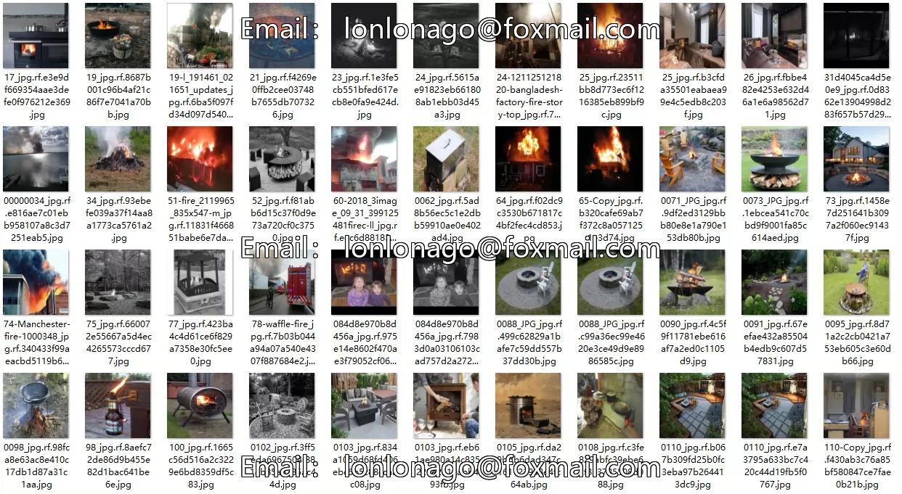
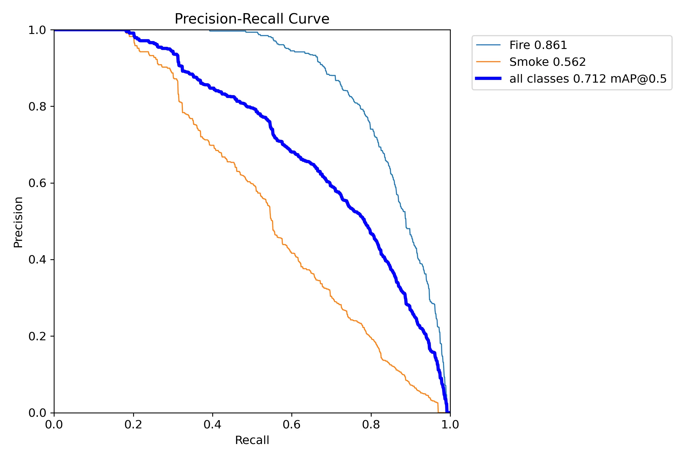
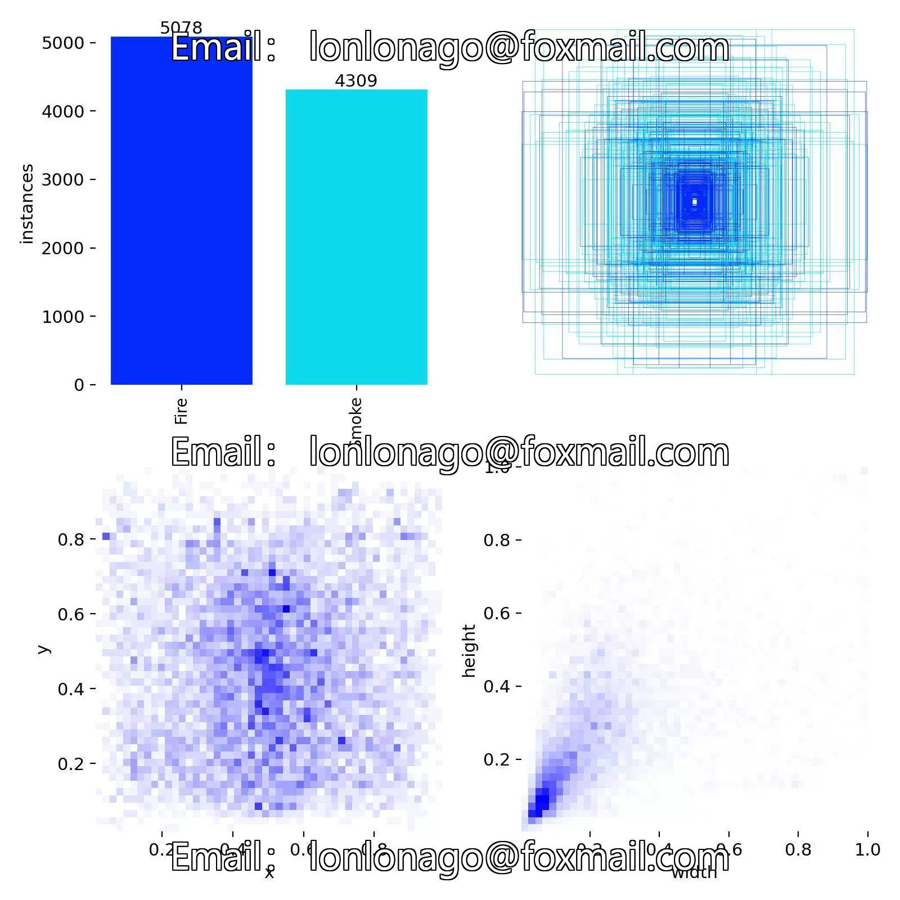
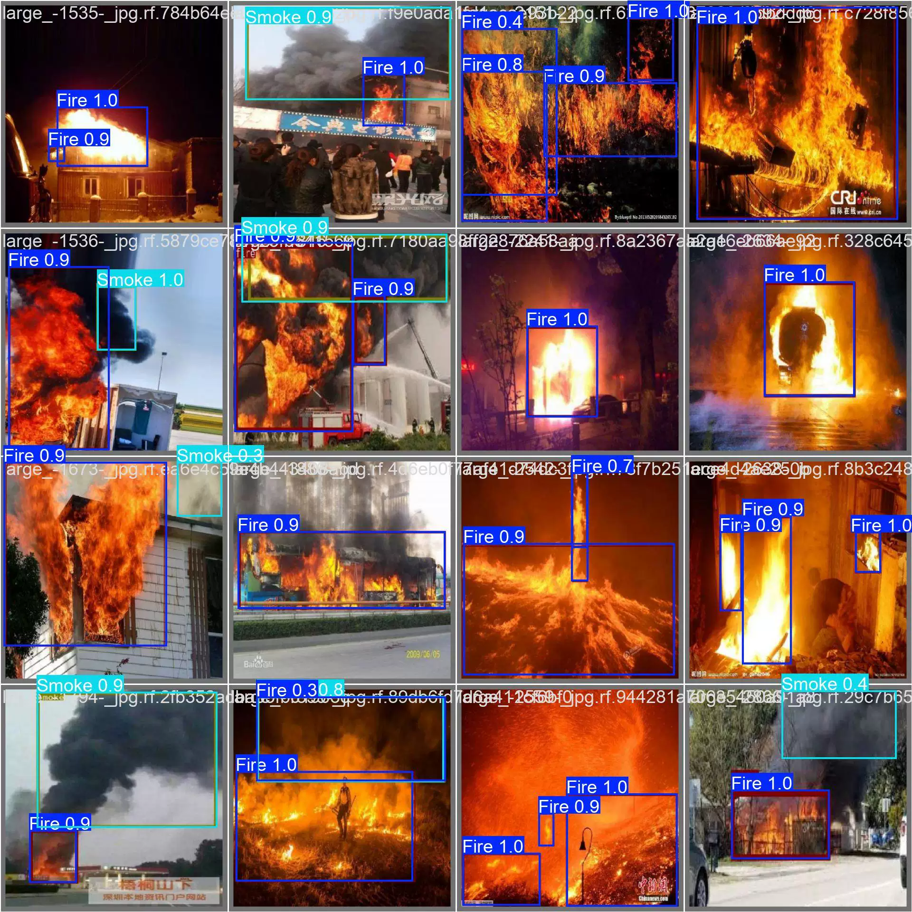
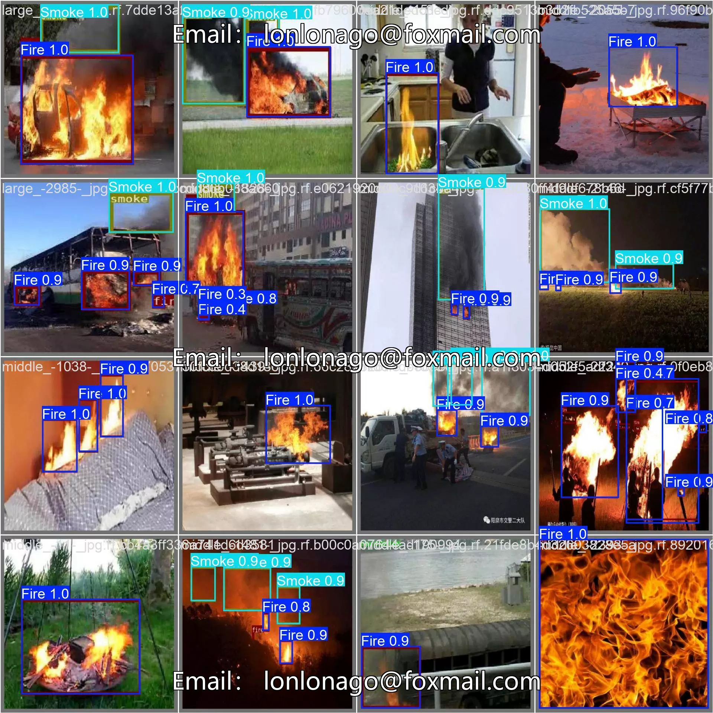
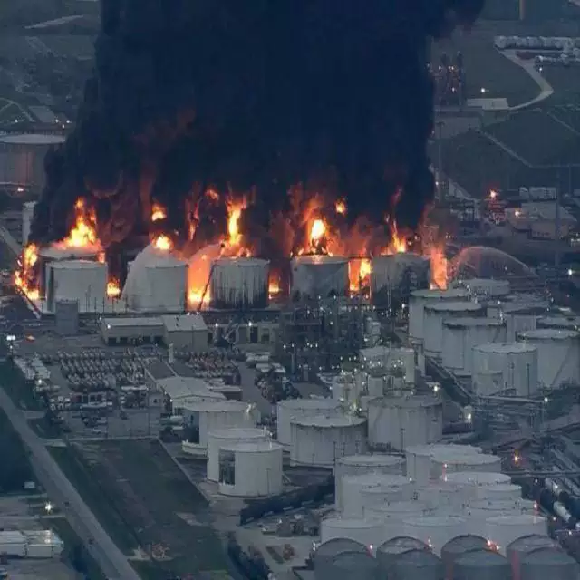
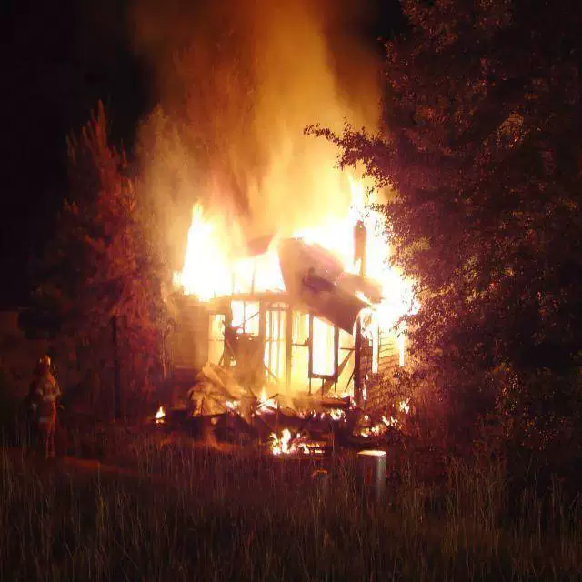

## Body

火灾烟雾目标检测数据集 YOLO格式

Totally 4000 images, each labeled with tags. The dataset has been divided into train (3,202), validation (403), and test (395) sets.

The dataset is divided into two classes: 'Fire' and 'Smoke'.

The dataset includes a YOLOv8s weight file (100 training rounds, YOLOv8s.pt as the pre-trained model, mAP@0.5 0.712).

## Images

item_1060839456401

Here is a pay link on Stripe ( https://buy.stripe.com/3cs8yP7sY87d0vu9AB ). Please contact me lonlonago@foxmail.com after funding $89, and I will send you a complete data files , thank you!

